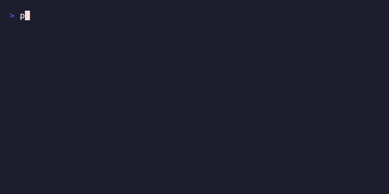

# Preflight

[](https://github.com/vertti/preflight/actions/workflows/ci.yml)
[](https://codecov.io/gh/vertti/preflight)
[](https://goreportcard.com/report/github.com/vertti/preflight)
[](https://github.com/securego/gosec)
[](https://pkg.go.dev/golang.org/x/vuln/cmd/govulncheck)

> Validation toolkit for containers and CI. Single binary, zero dependencies.



## Quick Start

```dockerfile
COPY --from=ghcr.io/vertti/preflight:latest /preflight /usr/local/bin/preflight

RUN preflight cmd node --min 18.0        # verify binary + version
RUN preflight env DATABASE_URL           # env var exists
RUN preflight file /app/config.yaml      # file exists
RUN preflight tcp postgres:5432 --retry 5 --retry-interval 2s  # wait for DB

HEALTHCHECK CMD ["/preflight", "http", "http://localhost:8080/health"]
```

## What It Does

Pre-flight checks for containers: verify services, environment, dependencies. Each check does multiple things and tells you exactly what failed.

- **One command, multiple checks** — `preflight cmd node --min 18.0` verifies: on PATH, actually runs, returns version, meets constraint
- **Works without a shell** — Runs in distroless/scratch, no shell required
- **Container-aware** — Reads cgroup limits, not just host /proc/meminfo
- **Version constraints** — `--min ^1.0` uses semver, not string comparison

```
[OK] cmd: node
     path: /usr/local/bin/node
     version: 20.10.0

[FAIL] cmd: python
       version 3.9.0 < minimum 3.11
```

Exit code `0` on success, `1` on failure. Works with `set -e`, Docker `RUN`, and CI pipelines.

## Use Cases

- **Docker builds** — verify binaries, configs during image build
- **Startup** — wait for databases before your app starts
- **CI** — validate environment, connectivity, checksums
- **Health checks** — HTTP/TCP without curl or netcat

## FAQ

<details>
<summary><b>Why not just shell scripts?</b></summary>

Shell works for simple checks. But this:

```bash
# Check node exists, runs, and version >= 18
command -v node >/dev/null 2>&1 && \
  node --version 2>/dev/null | grep -oE '[0-9]+\.[0-9]+' | \
  awk -F. '{if ($1 >= 18) exit 0; else exit 1}' || \
  (echo "node missing or wrong version"; exit 1)
```

Becomes:

```bash
preflight cmd node --min 18.0
```

Preflight also helps when you need:

- Checks in minimal images (no shell available)
- Container-aware resource limits (cgroup detection)
- Semantic version constraints (`^1.0`, `>=2.0, <3.0`)
- Consistent output format across all checks

</details>

<details>
<summary><b>Does this add bloat/attack surface?</b></summary>

- 2MB binary (Linux), no C dependencies
- 3 direct dependencies (cobra, semver, x/term)
- Security scans on every commit (govulncheck, gosec)
- Auto-updated via Renovate

To exclude from final image: [multi-stage builds](docs/usage.md#keeping-containers-clean)

</details>

<details>
<summary><b>Why not curl for health checks?</b></summary>

Curl works. Preflight is useful when curl isn't in your image, or you need JSON path assertions, built-in retry, or you're already using it for other checks.

</details>

## Install

**In containers:**

```dockerfile
COPY --from=ghcr.io/vertti/preflight:latest /preflight /usr/local/bin/preflight
```

> Want to keep your final image lean? See [Keeping Containers Clean](docs/usage.md#keeping-containers-clean) for multi-stage builds and external validation.

**On your machine / CI:**

```sh
curl -fsSL https://raw.githubusercontent.com/vertti/preflight/main/install.sh | sh
```

[Other install methods](docs/install.md)

## Usage

See the **[full usage guide](docs/usage.md)** for all commands and options.

### Check commands

```sh
preflight cmd node                            # exists and runs
preflight cmd node --min 18.0                 # version constraint
preflight cmd ffmpeg --version-cmd -version   # custom version flag
```

[All cmd options](docs/usage.md#preflight-cmd)

### Check environment variables

```sh
preflight env DATABASE_URL                       # exists and non-empty
preflight env MODEL_PATH --match '^/models/'     # matches pattern
preflight env APP_ENV --one-of dev,staging,prod  # allowed values
```

[All env options](docs/usage.md#preflight-env)

### Check files and directories

```sh
preflight file /models/bert.onnx --not-empty   # file exists and has content
preflight file /var/log/app --dir --writable   # directory is writable
preflight file /app/entrypoint.sh --executable # script is executable
```

[All file options](docs/usage.md#preflight-file)

### Check HTTP endpoints

```sh
preflight http http://localhost:8080/health         # basic health check
preflight http https://api.example.com --status 204 # custom status code
preflight http http://localhost/ready --retry 3     # retry on failure
```

[All http options](docs/usage.md#preflight-http)

### Verify file checksums

```sh
preflight hash --sha256 67574ee...2cf myfile.tar.gz  # verify SHA256
preflight hash --checksum-file SHASUMS256.txt app.tar.gz  # from checksum file
```

[All hash options](docs/usage.md#preflight-hash)

### Run checks from a file

Create a `.preflight` file in your project:

```sh
# .preflight
file /etc/localtime --not-empty
cmd myapp --min 2.0
cmd go
env HOME
```

Run all checks:

```sh
preflight run                             # finds .preflight automatically
preflight run --file /path/to/.preflight  # specify file explicitly
```

[File format, discovery, and hashbang support](docs/usage.md#preflight-run)

## Security

Preflight is designed for security-sensitive environments like CI pipelines and container builds. We take code quality seriously:

- **[gosec](https://github.com/securego/gosec)** — Static analysis for security vulnerabilities
- **[govulncheck](https://pkg.go.dev/golang.org/x/vuln/cmd/govulncheck)** — Dependency vulnerability scanning
- **20+ linters** via [golangci-lint](https://golangci-lint.run/) including nil-safety and error handling checks

All security checks run in CI on every commit.

## License

Apache 2.0
